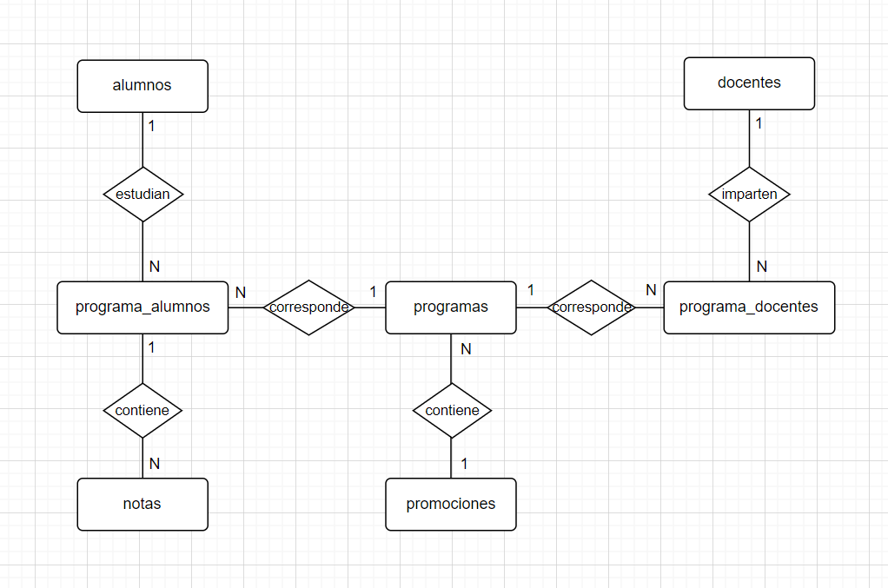
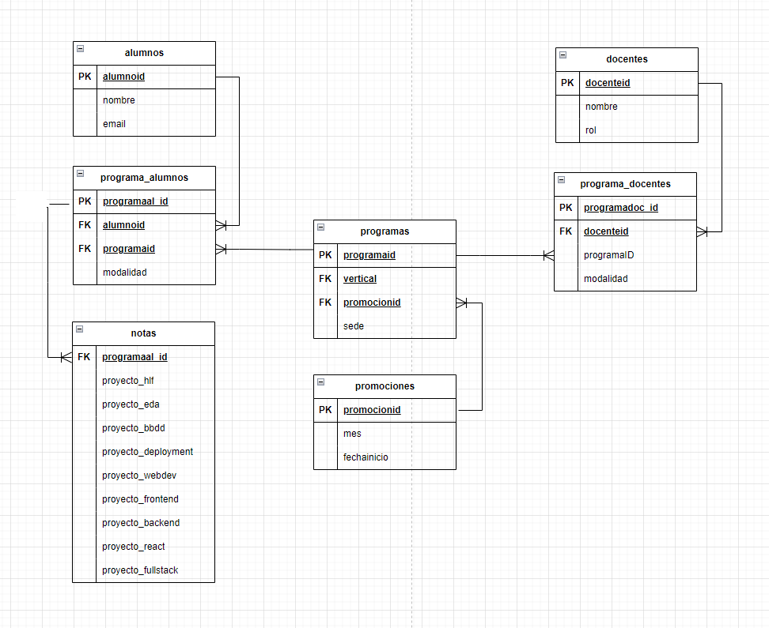

# Proyecto de Creación de Base de Datos Relacional

## Descripción

Este proyecto consiste en la creación de una base de datos relacional para gestionar información de alumnos y docentes de una escuela de bootcamps. A partir de unos datos de entrada sin normalizar, se ha diseñado una estructura normalizada y escalable de base de datos que soporte la gestión académica y administrativa de una institución educativa de estas caracterísitcas.

## Objetivos

- ✔️ **Normalización de Datos:** para eliminar la redundancia y garantizar la integridad de los datos.
- ✔️ **Modelo Entidad-Relación (E/R):** que represente la estructura de la base de datos normalizada.
- ✔️ **Modelo Lógico de la Base de Datos:** Con base en el modelo E/R, desarrollar un modelo lógico.
- ✔️ **Creación de la Base de Datos:** Utilizando el sistema de gestión de bases de datos de PostgreSQL.
- ❌ **Alojar en algún servidor** vuestras bases de datos para poder acceder desde aplicaciones de terceros.

## Assumptions

- Los alumnos pueden cursar diferentes bootcamps en diferentes promociones y modalidades; no al mismo tiempo.
- Los docentes pueden impartir el mismo bootcamp en diferentes promociones y modalidades.
- La modalidad de los alumnos se deja por completar ya que no se nos ha proporcionado el dato. Interesante para escalabilidad.
- Las docentes Rosalva Ayuso y Angelica Corral estan asociadas a programas sin alumnos, y por tanto sin promocion asociada; no los incluimos hasta tener los datos completos.

## Modelo Entidad-Relación (E/R)



## Modelo Lógico de la Base de Datos



## Estructura de la Base de Datos

La base de datos está compuesta por las siguientes tablas:

- **alumnos**: Almacena información sobre los alumnos.
- **docentes**: Almacena información sobre los docentes.
- **programa_alumnos**: Relaciona los alumnos con los programas en los que están inscritos.
- **programa_docentes**: Relaciona los docentes con los programas en los que enseñan.
- **programas**: Almacena información sobre los programas académicos.
- **promociones**: Almacena información sobre las promociones de los programas.
- **notas**: Almacena las notas de los alumnos en los distintos programas.

## Descripción de las Tablas

### alumnos

- **alumnoid**: Identificador único del alumno (integer).
- **nombre**: Nombre del alumno (text).
- **email**: Dirección de correo electrónico del alumno (text).

### docentes

- **docenteid**: Identificador único del docente (integer).
- **nombre**: Nombre del docente (text).
- **rol**: Rol del docente en la institución (text).

### programa_alumnos

- **programaal_id**: Identificador único de cada programa cursado por cada alumno (integer).
- **alumnoid**: Identificador del alumno (integer).
- **programaid**: Identificador del programa (integer).
- **modalidad**: Modalidad del programa (text).

### programa_docentes

- **programado_id**: Identificador único de cada programa cursado por cada docente (integer).
- **docenteid**: Identificador del docente (integer).
- **programaid**: Identificador del programa (integer).
- **modalidad**: Modalidad del programa (text).

### programas

- **programaid**: Identificador único del programa [vertical - sede - promocion] (integer).
- **vertical**: Identificador del área vertical del programa (text).
- **promocionid**: Identificador de la promoción del programa (integer).
- **sede**: Sede del programa (text).

### promociones

- **promocionid**: Identificador único de la promoción (integer).
- **mes**: Mes de inicio de la promoción (text).
- **fechainicio**: Fecha de inicio de la promoción (text).

### notas

- **programaal_id**: Identificador de la relación programa-alumno (integer).
- **proyecto 1 - 9**: nota de cada proyecto (Apto / No Apto / Null) (text).
- **nombre**: nombre completo del alumno (text).
  

## Queries test
#### Consultar todas las notas de cada alumno (ordenado por vertical y nombre):
```sql
SELECT al.alumnoid, al.nombre, pr.vertical, n.proyecto_hlf, n.proyecto_eda, n.proyecto_bbdd, n.proyecto_deployment,
n.proyecto_webdev, n.proyecto_frontend, n.proyecto_backend, n.proyecto_react, n.proyecto_fullstack
FROM alumnos al
INNER JOIN programa_alumnos pral ON pral.alumnoid = al.alumnoid
INNER JOIN programas pr ON pr.programaid = pral.programaid
INNER JOIN notas n ON n.programaal_id = pral.programaal_id
ORDER BY pr.vertical, al.nombre
```

#### Consultar las notas de un Data Science:
```sql
SELECT al.alumnoid, al.nombre, pr.vertical, n.proyecto_hlf, n.proyecto_eda, n.proyecto_bbdd, n.proyecto_deployment
FROM alumnos al
INNER JOIN programa_alumnos pral ON pral.alumnoid = al.alumnoid
INNER JOIN programas pr ON pr.programaid = pral.programaid
INNER JOIN notas n ON n.programaal_id = pral.programaal_id
WHERE pr.vertical = 'Data Science'
```

#### Consultar la vertical que imparte cada docente:
```sql
SELECT d.docenteid, d.nombre, d.rol, pro.vertical
FROM docentes d
INNER JOIN programa_docentes prd ON prd.docenteid = d.docenteid
INNER JOIN programas pro ON pro.programaid = prd.programaid
INNER JOIN promociones pr ON pr.promocionid = pro.promocionid
```

#### Consultar todos los docentes que imparten una vertical específica:
```sql
SELECT d.docenteid, d.nombre, d.rol, pro.vertical
FROM docentes d
INNER JOIN programa_docentes prd ON prd.docenteid = d.docenteid
INNER JOIN programas pro ON pro.programaid = prd.programaid
INNER JOIN promociones pr ON pr.promocionid = pro.promocionid
WHERE pro.vertical = 'Full Stack'
```

#### Consultar todos los docentes que tienen un rol específico:
```sql
SELECT d.docenteid, d.nombre, d.rol, pro.vertical
FROM docentes d
INNER JOIN programa_docentes prd ON prd.docenteid = d.docenteid
INNER JOIN programas pro ON pro.programaid = prd.programaid
INNER JOIN promociones pr ON pr.promocionid = pro.promocionid
WHERE d.rol = 'TA'
```

#### Consultar a qué promoción está apuntado cada alumno y en qué día empezó:
```sql
SELECT al.alumnoid, al.nombre, pr.mes, pr.fechainicio
FROM alumnos al
INNER JOIN programa_alumnos pral ON pral.alumnoid = al.alumnoid
INNER JOIN programas pro ON pro.programaid = pral.programaid
INNER JOIN promociones pr ON pr.promocionid = pro.promocionid
```

#### Consultar cuantos alumnos le corresponde a cada docente:
```sql
SELECT DISTINCT doc.docenteid AS "DocenteID", doc.nombre AS "NombreProfesor", count(al.alumnoid) AS "AlumnosPorDocente"
FROM alumnos al
INNER JOIN programa_alumnos pral ON pral.alumnoid = al.alumnoid
INNER JOIN programas pro ON pro.programaid = pral.programaid
INNER JOIN programa_docentes prd ON prd.programaid = pro.programaid
INNER JOIN docentes doc ON doc.docenteid = prd.docenteid
GROUP BY  doc.docenteid, doc.nombre
```
